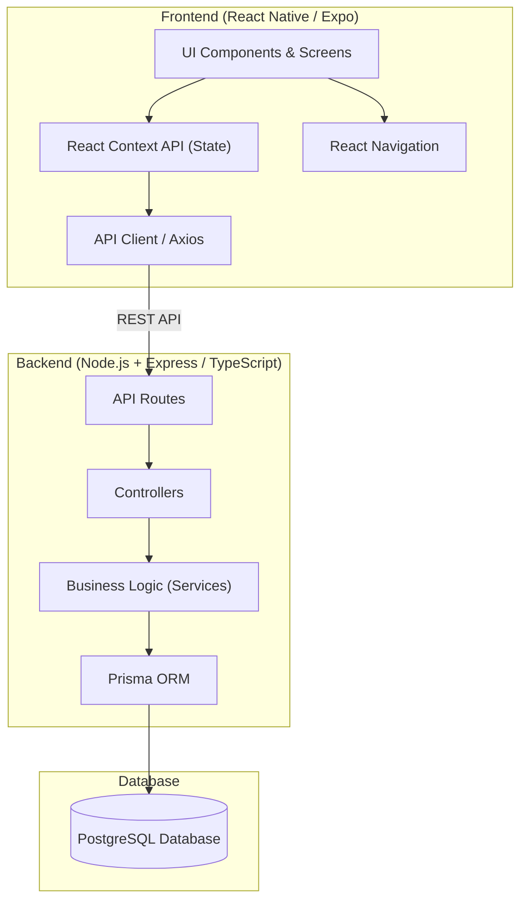
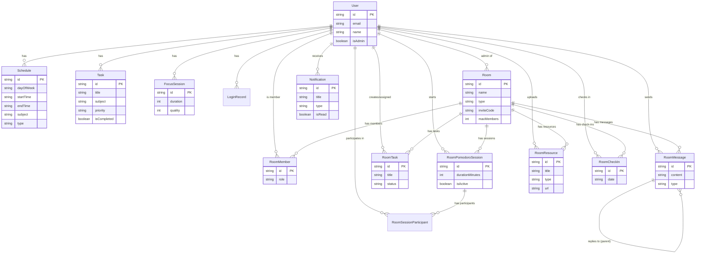

# Planetto

Planetto is a sleek, highly-polished React Native mobile application built with Expo and backed by a robust Node.js/Express backend. Designed for modern task management, deep focus sessions, class scheduling, and elegant productivity tracking. The app features a premium user interface with dynamic animations, glassmorphic elements, and a tailored UX for maximum focus.

## 🚀 Latest Features

- **Google Authentication:** Secure and seamless Google sign-in integration across Web, iOS, and Android.
- **Smart Dashboard & Tasks:** Activity overview, Smart Flow Optimization, infinite scroll date selector, swipe actions, and robust data synchronization.
- **Focus Mode:** Customizable timers, automated task completion linkage, and ambient sounds.
- **My Classes & Rooms:** Dynamic extra class scheduling, attendance tracking, and glassmorphic workspace organization.
- **Global Statistics:** Productivity trend visualization and goal tracking.
- **Premium UI/UX:** Zero-flicker dark/light transitions, custom avatars, and optimized renders.
- **Native Android Enhancements:** Configured for React Native New Architecture compatibility with explicit JDK/NDK environment configurations.

## 🏗️ System Architecture

The project is structured into a modern full-stack mobile application, connecting an Expo React Native frontend to a TypeScript Express backend using PostgreSQL.



## 🗄️ Database ER Diagram (Planetto)

Below is the Entity-Relationship (ER) diagram representing the actual database schema for Planetto, driven by Prisma and PostgreSQL. It outlines the core relationships between Users, Rooms, Tasks, and Scheduling.



## 🛠️ Tech Stack

### Frontend
- **Framework:** React Native & Expo
- **Navigation:** React Navigation
- **State Management:** React Context API
- **UI Elements:** expo-linear-gradient, react-native-svg, vector icons

### Backend
- **Runtime & Framework:** Node.js, Express, TypeScript
- **Database & ORM:** PostgreSQL, Prisma
- **Authentication:** Google OAuth 2.0 / JWT
- **Architecture:** Controller-Service-Route Pattern

## 🚀 Getting Started

1. **Clone the repository and install dependencies:**
   ```bash
   npm install
   cd backend && npm install
   ```
2. **Setup environment variables:**
   Configure `.env` for the backend with PostgreSQL connection strings and Google Client IDs.
3. **Run database migrations:**
   ```bash
   cd backend && npx prisma migrate dev
   ```
4. **Start the backend server:**
   ```bash
   npm run dev
   ```
5. **Start the Expo frontend:**
   ```bash
   cd .. && npm run start
   ```
   *(Use `npx expo run:android` or `npx expo run:ios` for native builds)*
